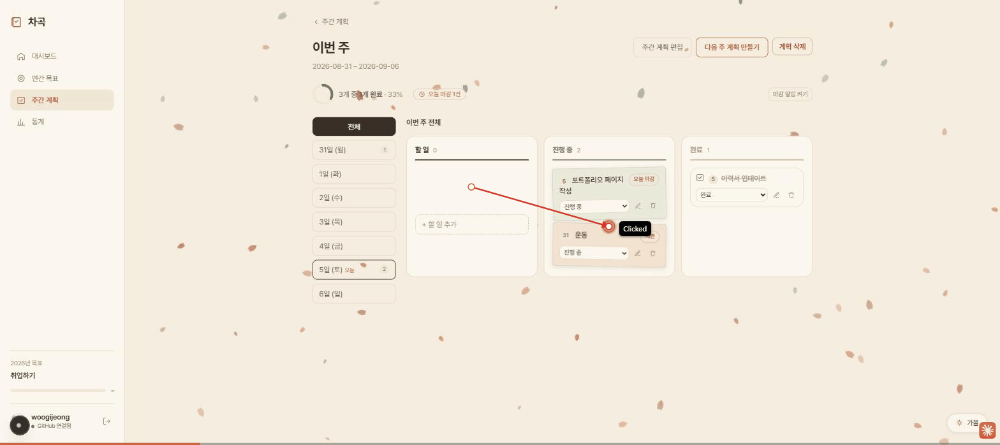
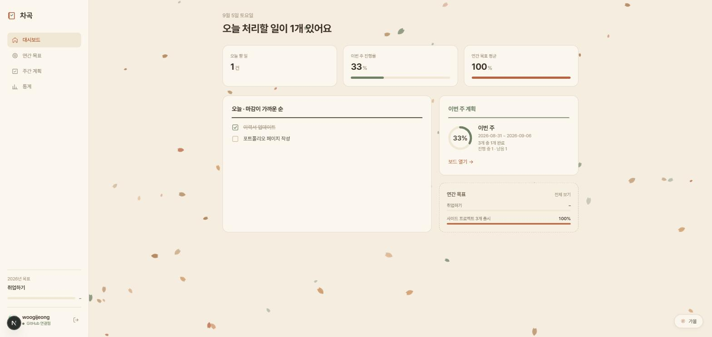
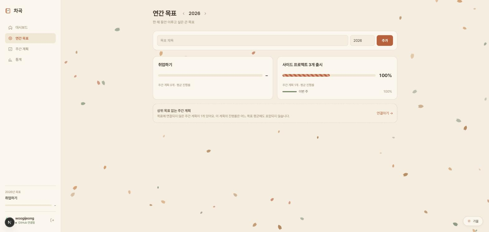
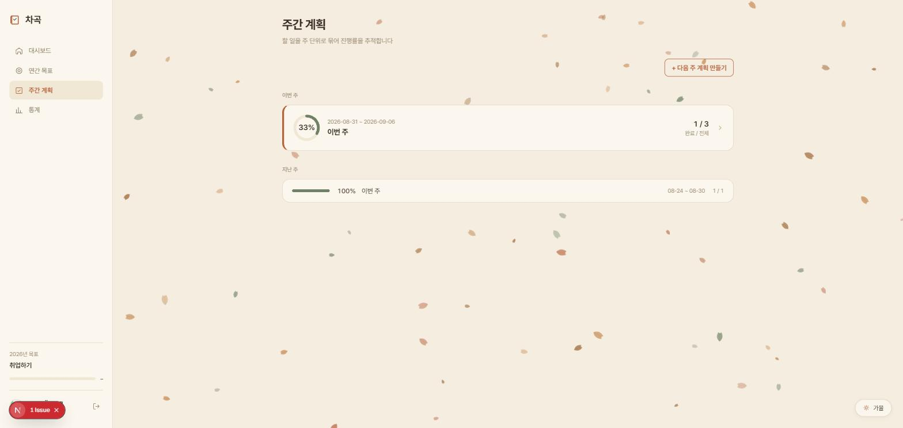
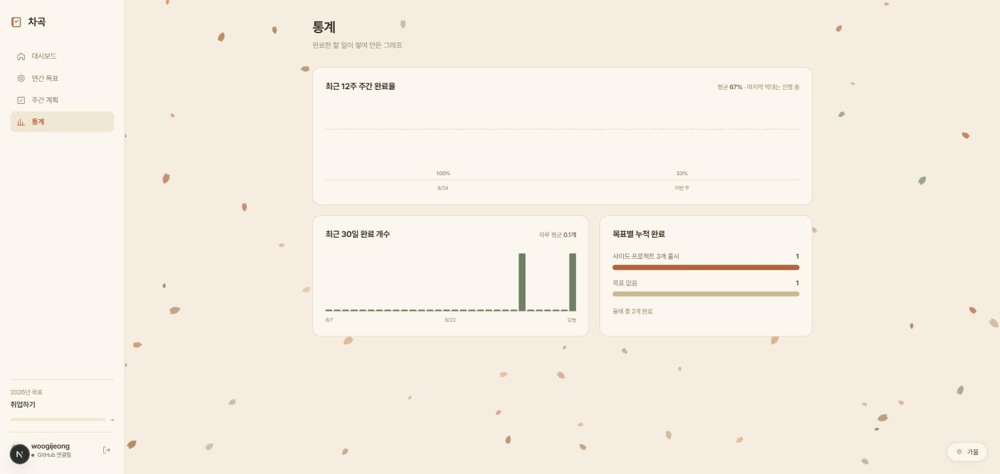

# 차곡

**할 일 → 주간 계획 → 연간 목표**를 하나의 흐름으로 연결하는 개인용 할 일 관리 앱입니다.
매일의 작은 실행이 쌓여 한 해의 목표가 되는 과정을 눈으로 확인할 수 있도록 만들었습니다.

> 이름 "차곡"은 "차곡차곡"에서 따왔습니다. 하루하루의 할 일이 쌓여 목표가 되는 것을 표현했습니다.

## 왜 만들었나

연간 목표는 세우지만 일상 실행과 연결되지 않아 흐지부지되는 경우가 많습니다. 차곡은

- 할 일 완료가 **주간 계획의 진행률**로,
- 주간 계획의 진행률이 다시 **연간 목표의 진행률**로

자동으로 이어지도록 설계해, 오늘의 할 일 하나가 올해 목표와 어떻게 연결되는지 항상 보이게 합니다.

## 스크린샷

카드를 드래그해서 `할 일 → 진행 중 → 완료`로 옮기면 주간 진행률이 즉시 갱신됩니다.



| 대시보드 | 연간 목표 |
| --- | --- |
|  |  |

| 주간 계획 목록 | 통계 |
| --- | --- |
|  |  |

- **주간 보드** — 할 일/진행 중/완료 3단 칸반 보드, 드래그 앤 드롭으로 상태 이동
- **대시보드** — 오늘 처리할 일, 이번 주 진행률, 연간 목표 평균을 한눈에 확인
- **연간 목표** — 목표별로 연결된 주간 계획과 평균 진행률 확인
- **주간 계획 목록** — 이번 주·지난 주 계획과 진행률을 리스트로 확인
- **통계** — 최근 12주 완료율, 최근 30일 완료 개수, 목표별 누적 완료 추이

## 주요 기능

- **3단 계층 구조**: 연간 목표(Yearly Goal) → 주간 계획(Weekly Plan) → 할 일(Task)
- **드래그 앤 드롭 칸반 보드**: `todo / doing / done` 상태를 카드 이동으로 변경 ([`@dnd-kit`](https://dndkit.com/) 사용)
- **진행률 자동 계산**: 할 일 상태가 바뀌면 주간 계획 진행률이, 주간 계획이 바뀌면 연간 목표 평균 진행률이 즉시 갱신
- **오늘/마감 임박 위젯**: 오늘 처리할 일과 마감이 가까운 할 일을 대시보드에서 바로 확인
- **GitHub OAuth 로그인**: 사용자별로 할 일을 분리해서 관리
- **통계 대시보드**: 최근 12주 완료율, 최근 30일 완료 개수, 목표별 누적 완료 그래프
- **차곡 디자인**: 종이 플래너에서 영감을 받은 따뜻한 색감과 계절 배경의 커스텀 UI

## 기술 스택

- [Next.js](https://nextjs.org) (App Router) + TypeScript
- [Tailwind CSS](https://tailwindcss.com)
- [MongoDB](https://www.mongodb.com/) (native driver, ODM 없이 직접 사용)
- [Zod](https://zod.dev)로 모든 Server Action 입력 검증
- [`@dnd-kit`](https://dndkit.com/)로 드래그 앤 드롭 보드 구현
- [Vitest](https://vitest.dev)로 진행률 계산 로직 등 단위 테스트

## 시작하기

### 1. 의존성 설치

```bash
npm install
```

### 2. 환경 변수 설정

`.env.local.example`을 참고해 `.env.local`을 작성합니다. GitHub OAuth 앱 등록 방법은 [`docs/GITHUB_OAUTH_SETUP.md`](docs/GITHUB_OAUTH_SETUP.md)를 참고하세요.

```bash
cp .env.local.example .env.local
```

### 3. 개발 서버 실행

```bash
npm run dev
```

[http://localhost:3000](http://localhost:3000) 에서 확인할 수 있습니다.

### 그 외 명령어

```bash
npm run build              # 프로덕션 빌드
npm run start              # 프로덕션 서버 실행
npm run lint                # ESLint
npm test                    # Vitest 테스트 실행
npm run init-indexes        # MongoDB 인덱스 생성
```

## 문서

- [PRD](docs/PRD.md) — 제품 요구사항 정의서
- [구현 계획](docs/PLAN.md) — 데이터 모델과 단계별 구현 계획
- [로그인/인증](docs/LOGIN.md), [GitHub OAuth 설정](docs/GITHUB_OAUTH_SETUP.md)
